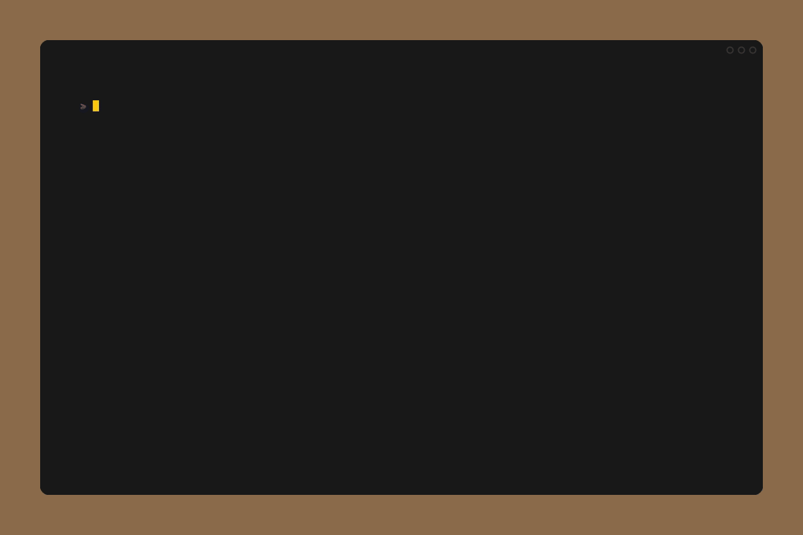
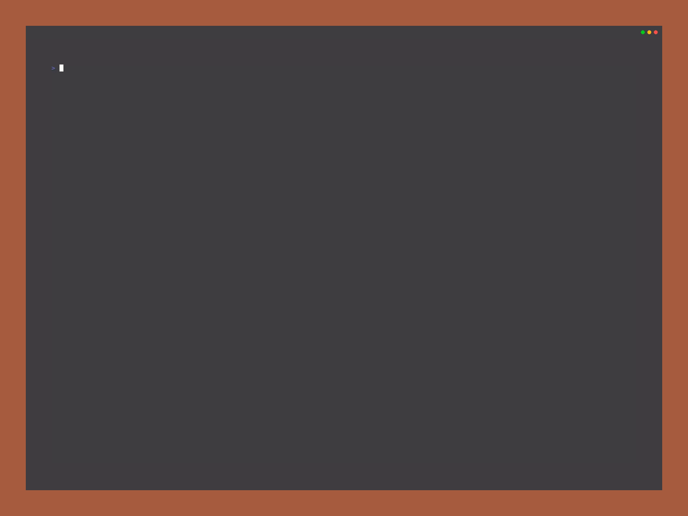
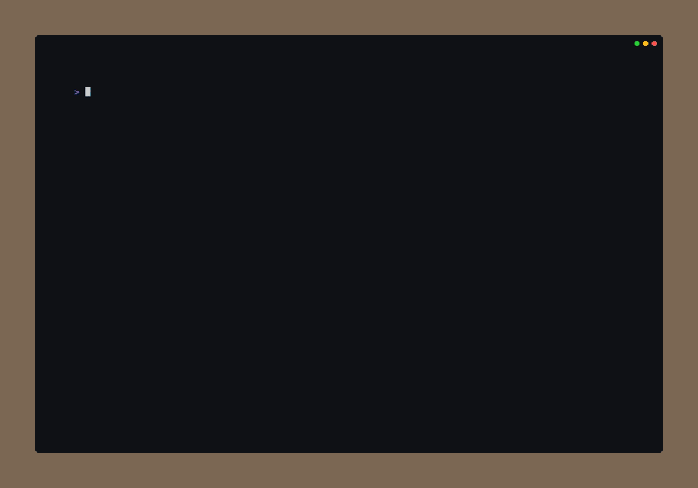
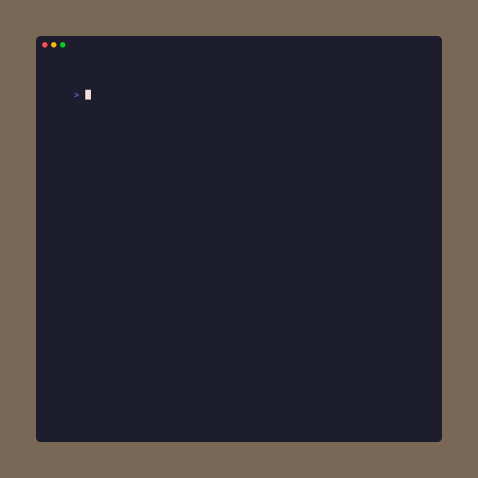
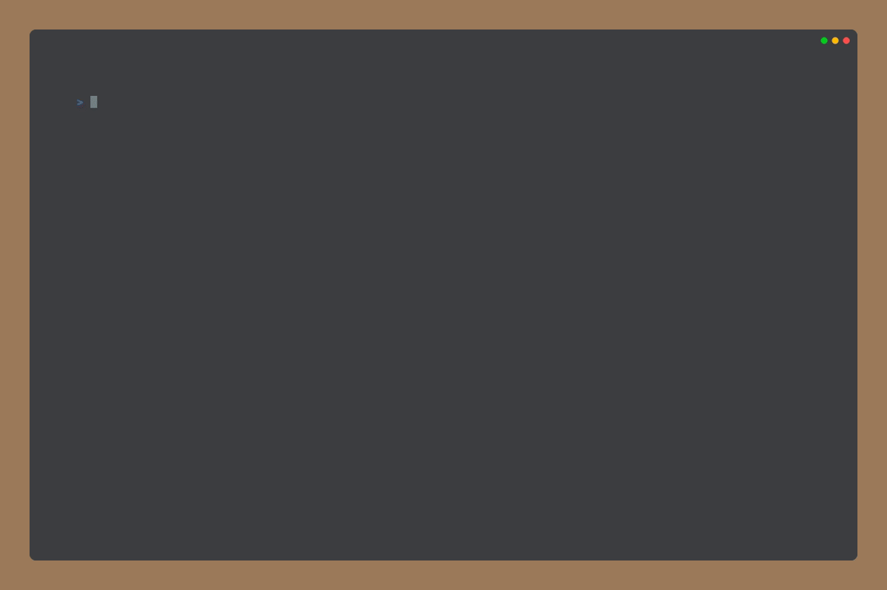
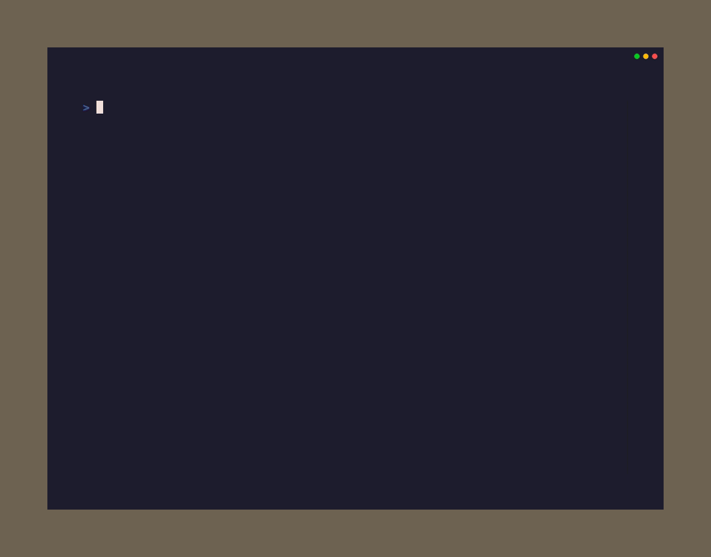
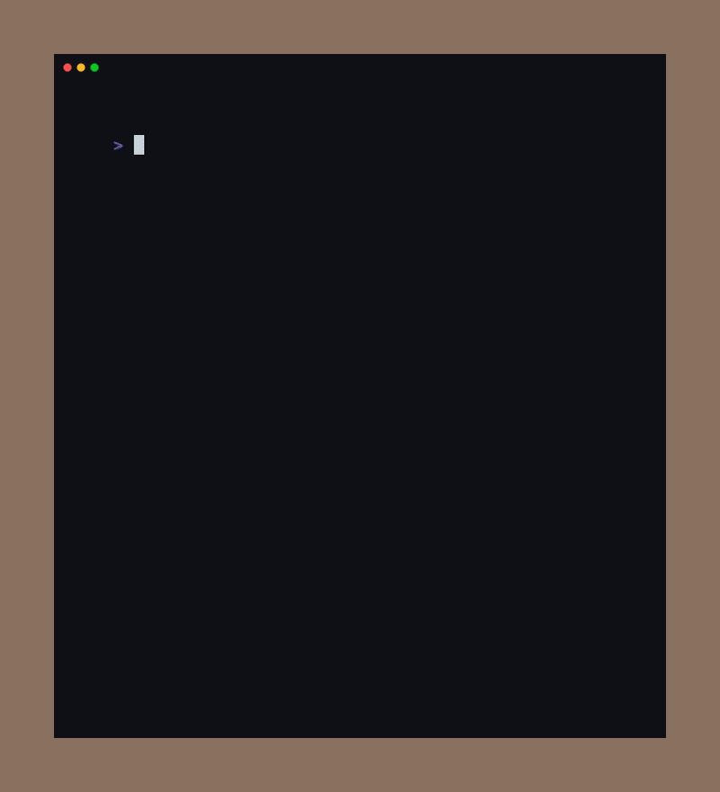

# PuzzleTea

A terminal-based puzzle game collection built with [Bubble Tea](https://github.com/charmbracelet/bubbletea).

Nine puzzle types, multiple difficulty modes, daily challenges, XP progression, 365 color themes, and a plugin architecture for adding new games.



## Features

- **9 puzzle games** -- Nonogram, Nurikabe, Sudoku, Shikaku, Word Search, Hashiwokakero, Hitori, Lights Out, Takuzu
- **Daily puzzles** -- A unique puzzle generated each day using deterministic seeding. Same date, same puzzle for everyone. Streak tracking rewards consecutive daily completions.
- **XP and leveling** -- Per-category levels based on victories. Harder modes yield more XP. Daily puzzles grant 2x XP.
- **Stats dashboard** -- Profile level, daily streak, victory counts, and XP progress bars per category.
- **365 color themes** -- Live-preview theme picker with WCAG-compliant contrast enforcement. Dark and light themes included.
- **Mouse support** -- Click and drag in Nonogram, Nurikabe, Shikaku, and Word Search. Lights Out supports click-to-toggle.
- **Seeded puzzles** -- Share a seed string to generate identical puzzles across sessions and machines.
- **Save/load persistence** -- Games auto-save to SQLite. Resume any in-progress game by name.

## Games

| Game | Description | Modes |
|------|-------------|-------|
| **Nonogram** | Fill cells to match row and column hints | Easy/Medium/Hard across 5x5, 10x10, 15x15, 20x20 |
| **Nurikabe** | Build islands while keeping one connected sea | 5 modes from 5x5 to 12x12 |
| **Shikaku** | Divide grid into rectangles matching cell counts | 5 modes from 7x7 to 11x11 |
| **Sudoku** | Classic 9x9 grid | Beginner, Easy, Medium, Hard, Expert, Diabolical |
| **Word Search** | Find hidden words in a letter grid | Easy, Medium, Hard (3-8 directions) |
| **Hashiwokakero** | Connect islands with bridges | 12 modes across 7x7 to 13x13 grids |
| **Hitori** | Shade cells to eliminate duplicates | 6 modes from 5x5 to 12x12 |
| **Lights Out** | Toggle lights to turn all off | Easy (3x3) to Extreme (9x9) |
| **Takuzu** | Fill grid with two symbols | 7 modes from 6x6 to 14x14 |

## Install

### Homebrew (macOS / Linux)

```bash
brew install FelineStateMachine/homebrew-tap/puzzletea
```

### AUR (Arch Linux)

```bash
yay -S puzzletea
```

### WinGet (Windows)

```powershell
winget install FelineStateMachine.puzzletea
```

### From release binaries

Download the latest binary for your platform from the [Releases](https://github.com/FelineStateMachine/puzzletea/releases) page.

### From source

Requires Go 1.24+.

```bash
go install github.com/FelineStateMachine/puzzletea@latest
```

Or clone and build:

```bash
git clone https://github.com/FelineStateMachine/puzzletea.git
cd puzzletea
just        # or: go build -o puzzletea
```

## Usage

Launch the interactive menu:

```
puzzletea
```

Start a new game directly:

```bash
puzzletea new nonogram medium
puzzletea new sudoku hard
puzzletea new lights-out
puzzletea new hashi easy
```

Resume and manage saved games:

```bash
puzzletea list                     # show saved games
puzzletea list --all               # include abandoned games
puzzletea continue amber-falcon    # resume by name
```

Use a seed for deterministic puzzle generation:

```bash
puzzletea new --set-seed myseed
```

Override the color theme:

```bash
puzzletea --theme "Catppuccin Mocha"
```

Flag aliases on the root command also work:

```bash
puzzletea --new nonogram:medium
puzzletea --continue amber-falcon
```

### CLI Aliases

Several shorthand names are accepted for games: `hashi`/`bridges` for Hashiwokakero, `lights` for Lights Out, `islands`/`sea` for Nurikabe, `binairo`/`binary` for Takuzu, `words`/`ws` for Word Search, `rectangles` for Shikaku.

## Controls

### Global

| Key | Action |
|-----|--------|
| `Enter` | Select |
| `Escape` | Go back |
| `Ctrl+N` | Return to main menu |
| `Ctrl+R` | Reset puzzle |
| `Ctrl+H` | Toggle full help |
| `Ctrl+E` | Toggle debug overlay |
| `Ctrl+C` | Quit |

### Navigation

Arrow keys, WASD, and Vim bindings (`hjkl`) are supported for grid movement across all games.

### Mouse

Nonogram, Nurikabe, Shikaku, and Word Search support click and drag. Lights Out supports click to toggle. See each game's help for details.

## Game Persistence

Games are automatically saved to `~/.puzzletea/history.db` (SQLite). Navigating away saves progress; quitting with `Ctrl+C` marks the game as abandoned. Completed games are preserved and can be revisited.

## Previews

### Nonogram
Fill cells to match row and column hints.



[Game details and controls](nonogram/README.md)

### Nurikabe
Build islands from clues while keeping one connected sea.



[Game details and controls](nurikabe/README.md)

### Shikaku
Divide the grid into rectangles, where each rectangle contains exactly the number of cells shown in its clue.



[Game details and controls](shikaku/README.md)

### Sudoku
Classic 9x9 number placement puzzle.


[Game details and controls](sudoku/README.md)

### Word Search
Find hidden words in a letter grid.



[Game details and controls](wordsearch/README.md)

### Hashiwokakero
Connect islands with bridges.


[Game details and controls](hashiwokakero/README.md)

### Hitori
Shade cells to eliminate duplicate numbers.



[Game details and controls](hitori/README.md)

### Lights Out
Toggle lights to turn all off.



[Game details and controls](lightsout/README.md)

### Takuzu
Fill the grid with two symbols following three simple rules.


[Game details and controls](takuzu/README.md)

## Building and Testing

[just](https://github.com/casey/just) is used as the command runner:

```bash
just              # build
just run          # build and run
just test         # run tests (go test ./...)
just test-short   # run tests, skipping slow generator tests
just lint         # run golangci-lint
just fmt          # format with gofumpt
just tidy         # go mod tidy
just install      # install to $GOPATH/bin
just clean        # remove build artifacts
just vhs          # generate all VHS GIF previews
```

Run a single package's tests:

```bash
go test ./nonogram/
go test ./sudoku/ -run TestGenerateGrid
```

All code must pass `gofumpt` and `golangci-lint` before committing. CI runs both on every PR.

## Adding a New Puzzle

PuzzleTea uses a plugin architecture. To add a new puzzle type:

### 1. Create the game package

Create a directory (e.g., `mypuzzle/`) with these files:

| File | Purpose |
|------|---------|
| `Gamemode.go` | Mode struct embedding `game.BaseMode`, `Spawn()`, `Modes` var, `init()` with `game.Register()` |
| `Model.go` | `Model` struct implementing `game.Gamer` |
| `Export.go` | `Save` struct, `GetSave()`, `ImportModel()` for persistence |
| `keys.go` | Game-specific `KeyMap` struct |
| `style.go` | lipgloss styling and rendering helpers |
| `generator.go` | Puzzle generation logic (if applicable) |
| `grid.go` | Grid type and serialization (for grid-based games) |
| `mypuzzle_test.go` | Tests (table-driven, save/load round-trip, generator validation) |
| `README.md` | Game docs: rules, controls table, modes table, quick start examples |

### 2. Wire it into the main application

These files in the project root must be edited:

- **`model.go`**: Import the package and add a `game.Category` entry to `GameCategories` (maintain alphabetical order). The import triggers `init()`, which registers save/load -- no blank import needed.
- **`resolve.go`**: Add the canonical name and any CLI aliases to `categoryAliases`.

### 3. Add a VHS preview

- Create `vhs/<game>.tape` following the format in existing tapes.
- Add the tape to the `vhs` target in the `justfile`.

### 4. Verify

```bash
just fmt && just lint && just test
```

See any existing game package (e.g., `nonogram/`) for the full pattern, and `AGENTS.md` for detailed conventions.

## License

[MIT](LICENSE)

## Built With

- [Bubble Tea](https://github.com/charmbracelet/bubbletea) - TUI framework
- [Lip Gloss](https://github.com/charmbracelet/lipgloss) - Terminal styling
- [Bubbles](https://github.com/charmbracelet/bubbles) - TUI components
- [Cobra](https://github.com/spf13/cobra) - CLI framework
- [modernc.org/sqlite](https://pkg.go.dev/modernc.org/sqlite) - Pure-Go SQLite
