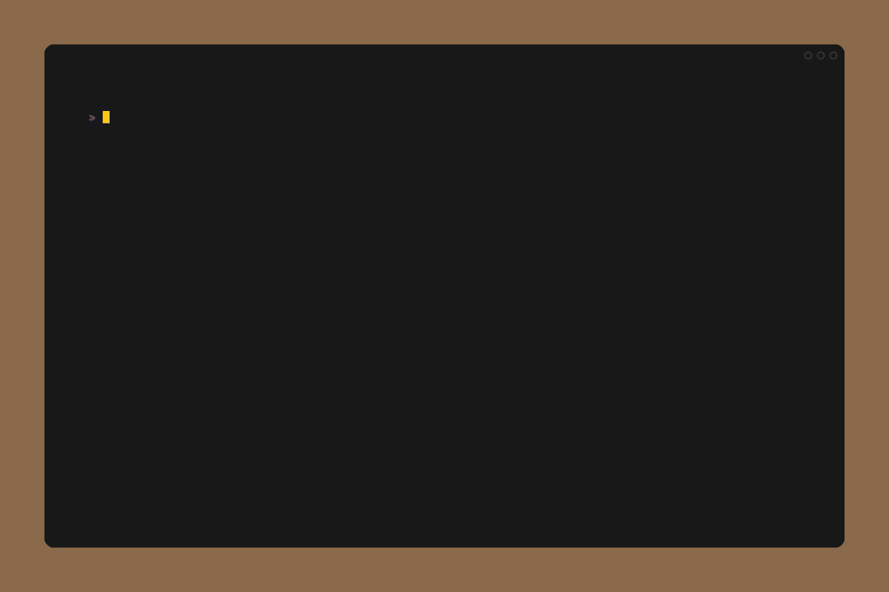
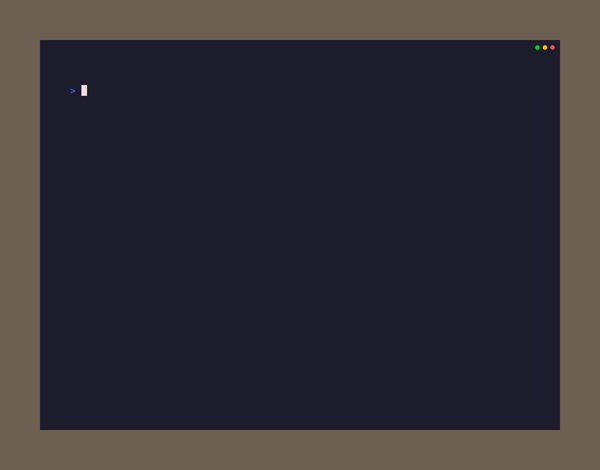
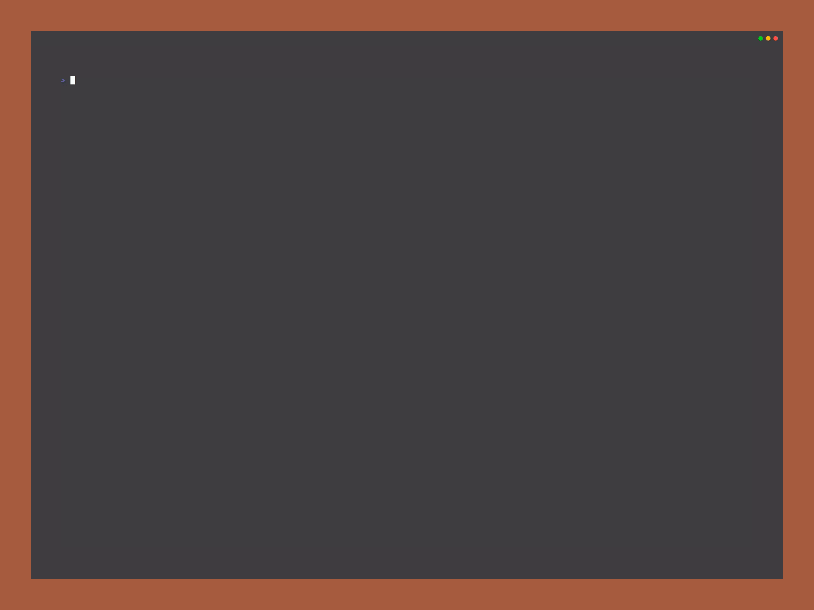
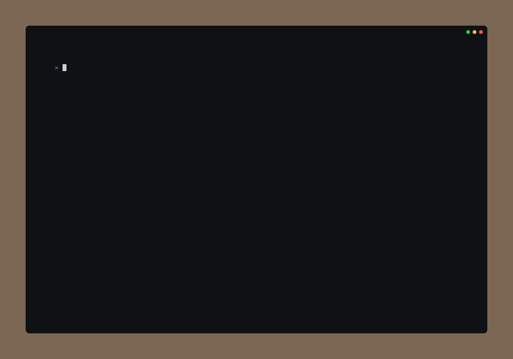
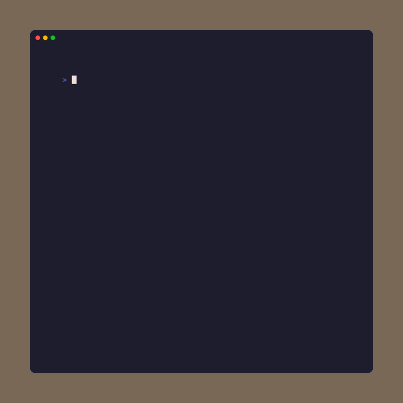
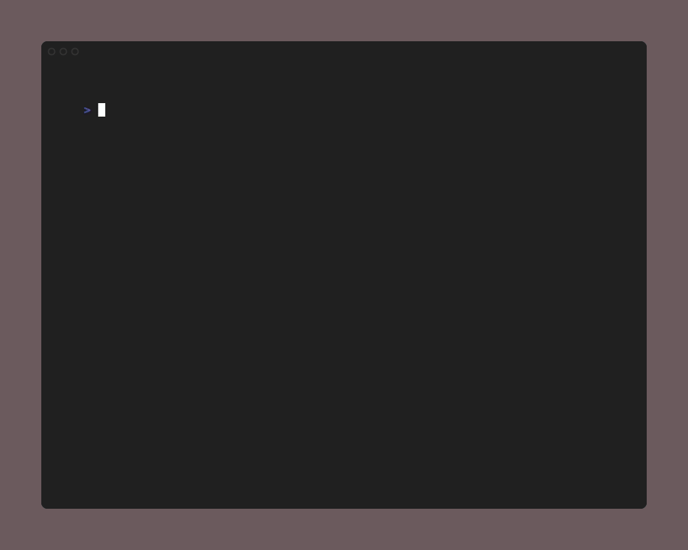
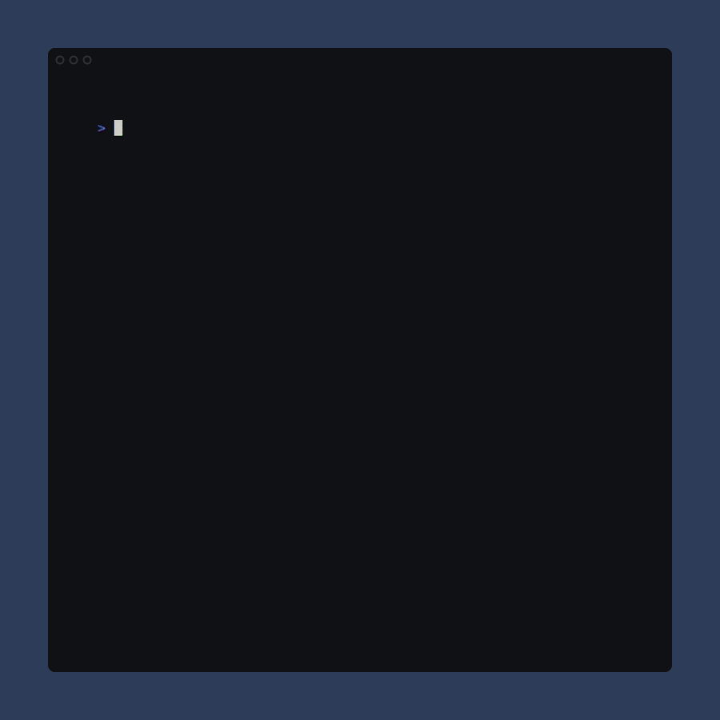
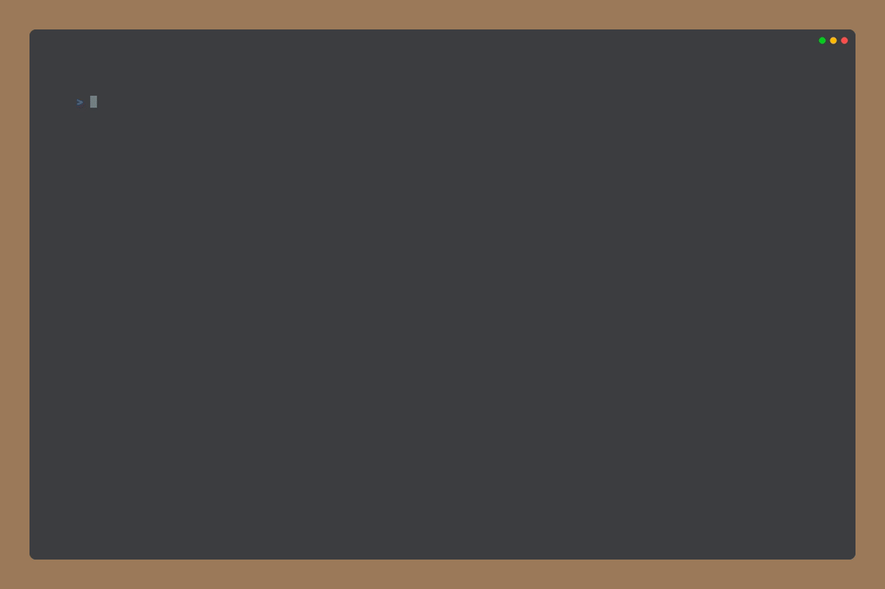
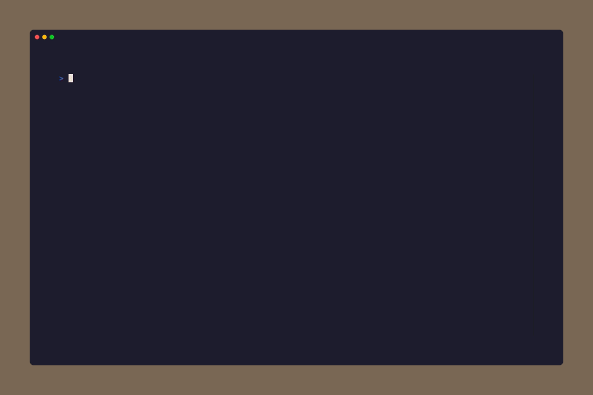
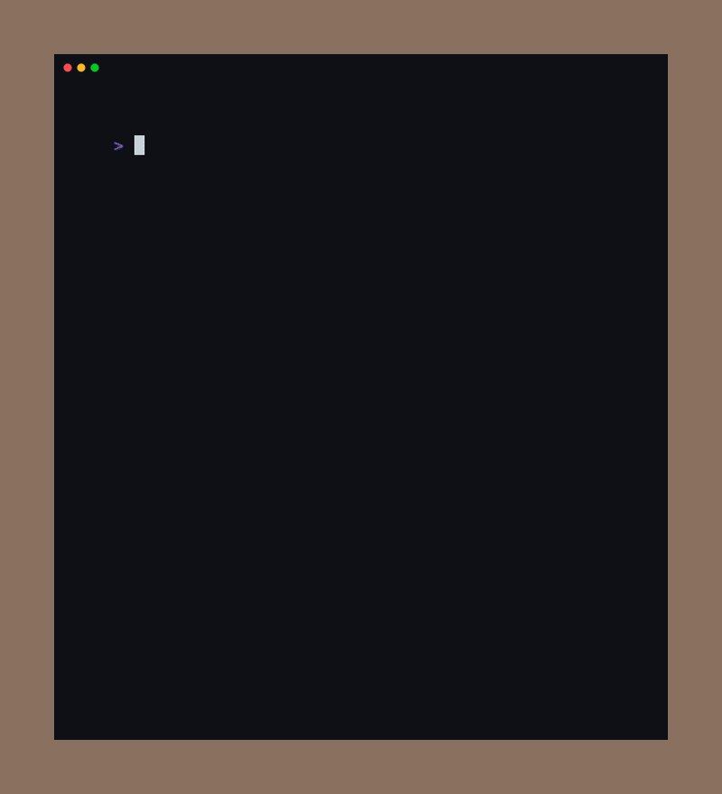

# PuzzleTea

A terminal-based puzzle game collection built with [Bubble Tea](https://github.com/charmbracelet/bubbletea).

Fourteen puzzle games, multiple difficulty modes, daily and weekly deterministic challenges, XP progression, 365 theme options, and an explicit built-in registry plus metadata catalog for adding new games.



## Features

- **14 puzzle games** -- Fillomino, Nonogram, Nurikabe, Ripple Effect, Shikaku, Sudoku, Sudoku RGB, Spell Puzzle, Word Search, Hashiwokakero, Hitori, Lights Out, Takuzu, Takuzu+
- **Daily puzzles** -- A unique puzzle generated each day using deterministic seeding. Same date, same puzzle for everyone. Streak tracking rewards consecutive daily completions.
- **Weekly gauntlet** -- Each ISO calendar week has a shared 99-puzzle ladder. The current week unlocks sequentially from `#01` to `#99`; past weeks can be reviewed from completed saves only.
- **XP and leveling** -- Per-category levels based on victories. Harder modes yield more XP. Daily puzzles grant 2x XP, and weekly puzzles add slot-based bonus XP.
- **Stats dashboard** -- Profile level, daily streak status, weekly completion progress, victory counts, and XP progress bars per category.
- **365 color themes** -- Live-preview theme picker with WCAG-compliant contrast enforcement. Dark and light themes included.
- **Mouse support** -- Drag interactions in Nonogram, Nurikabe, Shikaku, Spell Puzzle, and Word Search; click-to-focus in Fillomino, Hashiwokakero, Hitori, Sudoku, Sudoku RGB, Takuzu, and Takuzu+; click-to-toggle in Lights Out.
- **Seeded puzzles** -- Share a seed string to generate identical puzzles across sessions and machines.
- **Save/load persistence** -- Games auto-save to SQLite. Resume any in-progress game by name.

## Games

| Game | Description | Modes |
|------|-------------|-------|
| **Fillomino** | Grow numbered regions to their exact sizes | Mini 5x5 through Expert 12x12 |
| **Nonogram** | Fill cells to match row and column hints | 10 named modes from 5x5 `Mini` to 20x20 `Massive` |
| **Nurikabe** | Build islands while keeping one connected sea | 5 modes from 5x5 to 12x12 |
| **Ripple Effect** | Place digits in cages without violating ripple distance | Mini 5x5 through Expert 9x9 |
| **Shikaku** | Divide grid into rectangles matching cell counts | Mini 5x5 through Expert 12x12 |
| **Sudoku** | Classic 9x9 grid | Beginner, Easy, Medium, Hard, Expert, Diabolical |
| **Sudoku RGB** | Fill a 9x9 grid with three symbols so each row, column, and box contains three of each | Beginner, Easy, Medium, Hard, Expert, Diabolical |
| **Spell Puzzle** | Connect letters to reveal crossword words and bonus anagrams | Beginner, Easy, Medium, Hard |
| **Word Search** | Find hidden words in a letter grid | Easy 10x10, Medium 15x15, Hard 20x20 |
| **Hashiwokakero** | Connect islands with bridges | 12 modes across 7x7 to 13x13 grids |
| **Hitori** | Shade cells to eliminate duplicates | 6 modes from 5x5 to 12x12 |
| **Lights Out** | Toggle lights to turn all off | Easy (3x3) to Extreme (9x9) |
| **Takuzu** | Fill grid with two symbols | 7 modes from 6x6 to 14x14 |
| **Takuzu+** | Fill grid with symbols plus `=` and `x` relation clues | 7 modes from 6x6 to 14x14 |

## Install

### Homebrew (macOS / Linux)

```bash
brew install FelineStateMachine/homebrew-tap/puzzletea
```

### AUR (Arch Linux)

```bash
yay -S puzzletea
```

### WinGet (Windows)

```powershell
winget install FelineStateMachine.puzzletea
```

### From release binaries

Download the latest binary for your platform from the [Releases](https://github.com/FelineStateMachine/puzzletea/releases) page.

### From source

Requires Go 1.24+.

```bash
go install github.com/FelineStateMachine/puzzletea@latest
```

Or clone and build:

```bash
git clone https://github.com/FelineStateMachine/puzzletea.git
cd puzzletea
just        # or: go build -o puzzletea
```

## Usage

Launch the interactive menu:

```
puzzletea
```

The Play menu includes:

- `Create` for a new puzzle by category and mode
- `Continue` for saved games
- `Daily` for the shared deterministic daily puzzle
- `Weekly` for the current or historical weekly gauntlet
- `Seeded` for a custom deterministic seed

Weekly gauntlets use the ISO week-year format shown in the menu, for example
`Week 10-2026 # 7`. The `#` value is the currently active weekly challenge for
that week. Current-week puzzles unlock one at a time; older weeks are review-only.

Start a new game directly:

```bash
puzzletea new nonogram classic
puzzletea new fillomino "Hard 10x10"
puzzletea new ripple-effect "Medium 7x7"
puzzletea new sudoku hard
puzzletea new ripeto expert
puzzletea new spell beginner
puzzletea new lights-out
puzzletea new hashi "Easy 7x7"
```

Mode names are matched case-insensitively after normalizing spaces, hyphens,
and underscores. Multi-word mode titles usually need quotes.

Resume and manage saved games:

```bash
puzzletea list                     # show saved games
puzzletea list --all               # include abandoned games
puzzletea continue amber-falcon    # resume by name
```

Use seeds for deterministic puzzle generation:

```bash
# Deterministically selects game, mode, and puzzle from one seed.
puzzletea new --set-seed myseed

# Deterministically generates a puzzle within a chosen game/mode.
puzzletea new nonogram epic --with-seed myseed
```

Export printable puzzle sets to JSONL:

```bash
# Stream JSONL to stdout (redirect if desired)
puzzletea new nonogram mini --export 2 > nonogram-mini-set.jsonl

# Single mode export
puzzletea new nonogram mini -e 6 -o nonogram-mini-set.jsonl

# Mixed modes within a category (deterministic with --with-seed)
puzzletea new sudoku --export 10 -o sudoku-mixed.jsonl --with-seed zine-issue-01
```

Render one or more JSONL packs into a half-letter print PDF:

```bash
puzzletea export-pdf nonogram-mini-set.jsonl -o issue-01.pdf --shuffle-seed issue-01 --volume 1 --title "Catacombs & Pines"
```

`--title` sets the pack subtitle (title page, and cover pages when enabled), and `--volume` sets the volume number.
By default, covers are not included. Use `--cover-color` to include front/back cover pages.
Page count is always auto-padded to a multiple of 4 for half-letter booklet printing.

Font license note (Atkinson Hyperlegible Next):

- Follow the SIL OFL 1.1 requirements in `pdfexport/fonts/OFL.txt`.
- Do not sell the font files by themselves.
- If redistributing fonts with software, include the copyright notice and OFL text.
- Modified font versions must keep OFL terms, and modified names must respect Reserved Font Name rules.

`Lights Out` is currently excluded from export because it does not translate cleanly to paper workflows.

Override the color theme:

```bash
puzzletea --theme "Catppuccin Mocha"
```

Flag aliases on the root command also work:

```bash
puzzletea --new nonogram:classic
puzzletea --continue amber-falcon
```

### CLI Aliases

Several shorthand names are accepted for games: `polyomino`/`regions` for Fillomino, `hashi`/`bridges` for Hashiwokakero, `lights` for Lights Out, `islands`/`sea` for Nurikabe, `ripple` for Ripple Effect, `spell`/`spellpuzzle` for Spell Puzzle, `rgb sudoku`/`ripeto`/`sudoku ripeto` for Sudoku RGB, `binairo`/`binary` for Takuzu, `takuzu plus`/`binario+`/`binario plus` for Takuzu+, `words`/`wordsearch`/`ws` for Word Search, and `rectangles` for Shikaku.

## Controls

### Global

| Key | Action |
|-----|--------|
| `Enter` | Select |
| `Escape` | Return to the menu or go back |
| `Ctrl+R` | Reset puzzle |
| `Ctrl+H` | Toggle full help |
| `Ctrl+C` | Quit |

### Navigation

Arrow keys, WASD, and Vim bindings (`hjkl`) are supported for grid movement across all games.

### Mouse

Nonogram, Nurikabe, Shikaku, Spell Puzzle, and Word Search support drag interactions. Fillomino, Hashiwokakero, Hitori, Sudoku, Sudoku RGB, Takuzu, and Takuzu+ support mouse focus or click-to-cycle interactions. Lights Out supports click to toggle. See each game's help for details.

## Game Persistence

Games are automatically saved to `~/.puzzletea/history.db` (SQLite). Navigating away saves progress; quitting with `Ctrl+C` marks the game as abandoned. Completed games are preserved and can be revisited.

Daily and current-week weekly puzzles keep a single deterministic save per seed/week slot. Completed weekly puzzles from prior weeks reopen in review mode and are not modified when viewed again.

## Previews

### Fillomino
Grow numbered regions so each connected region reaches its exact size.



[Game details and controls](fillomino/README.md)

### Ripple Effect
Place digits in cages while keeping matching values outside each other’s ripple distance.


[Game details and controls](rippleeffect/README.md)

### Nonogram
Fill cells to match row and column hints.



[Game details and controls](nonogram/README.md)

### Nurikabe
Build islands from clues while keeping one connected sea.



[Game details and controls](nurikabe/README.md)

### Shikaku
Divide the grid into rectangles, where each rectangle contains exactly the number of cells shown in its clue.



[Game details and controls](shikaku/README.md)

### Sudoku
Classic 9x9 number placement puzzle.



[Game details and controls](sudoku/README.md)

### Sudoku RGB
Fill the grid with three symbols so every row, column, and box contains `{1,1,1,2,2,2,3,3,3}`.



[Game details and controls](sudokurgb/README.md)

### Word Search
Find hidden words in a letter grid.



[Game details and controls](wordsearch/README.md)

### Spell Puzzle
Connect letters from a fixed bank to reveal a crossword and score bonus words.

[Game details and controls](spellpuzzle/README.md)

### Hashiwokakero
Connect islands with bridges.



[Game details and controls](hashiwokakero/README.md)

### Hitori
Shade cells to eliminate duplicate numbers.


[Game details and controls](hitori/README.md)

### Lights Out
Toggle lights to turn all off.



[Game details and controls](lightsout/README.md)

### Takuzu
Fill the grid with two symbols following three simple rules.


[Game details and controls](takuzu/README.md)

## Building and Testing

[just](https://github.com/casey/just) is used as the command runner:

```bash
just              # build
just run          # build and run
just test         # run tests (go test ./...)
just test-short   # run tests, skipping slow generator tests
just lint         # run golangci-lint
just fmt          # format with gofumpt
just tidy         # go mod tidy
just install      # install to $GOPATH/bin
just clean        # remove build artifacts
just vhs          # generate all VHS GIF previews
```

Run a single package's tests:

```bash
go test ./nonogram/
go test ./sudoku/ -run TestGenerateGrid
```

All code must pass `gofumpt` and `golangci-lint` before committing. CI runs both on every PR.

## Adding a New Puzzle

PuzzleTea uses an explicit built-in registry plus a metadata catalog. To add a new puzzle type:

### 1. Create the game package

Create a directory (e.g., `mypuzzle/`) with these files:

| File | Purpose |
|------|---------|
| `gamemode.go` | Mode structs embedding `game.BaseMode`, `Modes`, `ModeDefinitions`, package-level `Definition`, and the built-in `Entry` |
| `model.go` | `Model` struct implementing `game.Gamer` |
| `export.go` | `Save` struct, `GetSave()`, `ImportModel()` for persistence |
| `keys.go` | Game-specific `KeyMap` struct |
| `style.go` | lipgloss styling and rendering helpers |
| `generator.go` | Puzzle generation logic (if applicable) |
| `grid.go` | Grid type and serialization (for grid-based games) |
| `help.md` | Embedded rules/help content wired into the runtime entry |
| `print_adapter.go` | Optional printable export adapter for JSONL/PDF support |
| `mypuzzle_test.go` | Tests (table-driven, save/load round-trip, generator validation) |
| `README.md` | Game docs: rules, controls table, modes table, quick start examples |

Use `gameentry.BuildModeDefs(Modes)` and `gameentry.NewEntry(...)` so the
package exposes both metadata and its validated runtime wiring.

### 2. Wire it into the built-in registry

Edit the built-in registry once:

- **`registry/registry.go`**: Import the package and add its exported `Entry` to `all` (maintain alphabetical order).

The game package's `Definition` owns:

- canonical name
- description
- aliases
- menu modes
- daily-eligible modes
- help content
- save/import function

The `catalog` package is built from the registered entries and remains the pure
metadata index for names, aliases, and daily-mode lookup.

### 3. Add a VHS preview

- Create `vhs/<game>.tape` following the format in existing tapes.
- Add the tape to the `vhs` target in the `justfile`.

### 4. Verify

```bash
just fmt
just lint
just test-short
```

See any existing game package (e.g., `nonogram/`) for the full pattern, and `AGENTS.md` for detailed conventions.

## License

[MIT](LICENSE)

## Built With

- [Bubble Tea](https://github.com/charmbracelet/bubbletea) - TUI framework
- [Lip Gloss](https://github.com/charmbracelet/lipgloss) - Terminal styling
- [Bubbles](https://github.com/charmbracelet/bubbles) - TUI components
- [Cobra](https://github.com/spf13/cobra) - CLI framework
- [modernc.org/sqlite](https://pkg.go.dev/modernc.org/sqlite) - Pure-Go SQLite
