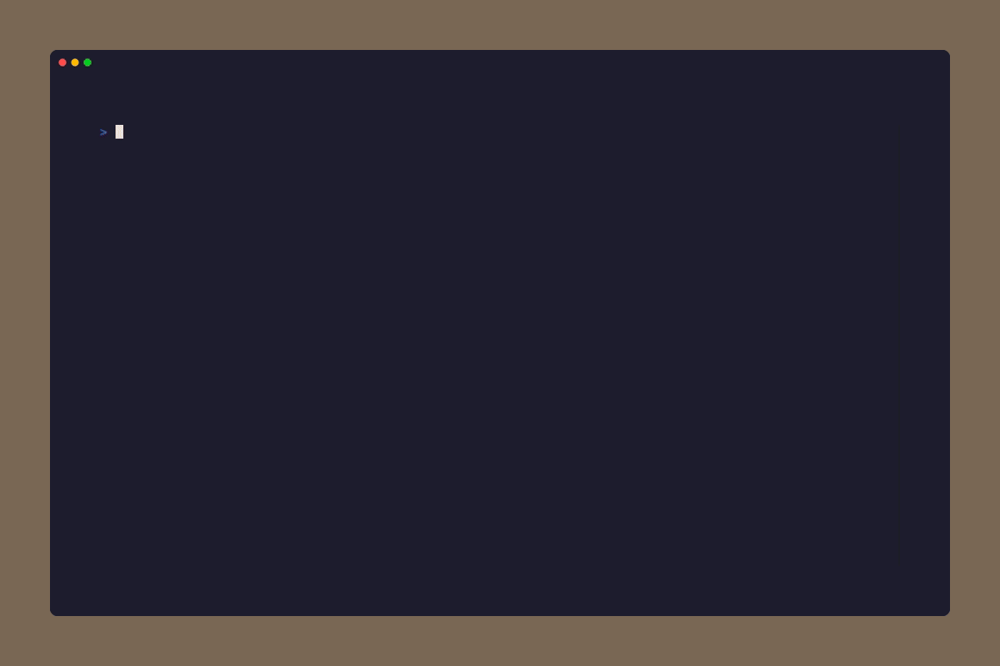

# Hashiwokakero

Connect islands with bridges to form a single connected group.



## How to Play

Islands are numbered circles on the grid. Each number indicates how many
bridges must connect to that island. Bridges run horizontally or vertically
between adjacent islands, may not cross, and can be single or double.
The puzzle is solved when every island has exactly the required number of
bridges and all islands are connected.

1. Navigate to an island and press `Enter` or `Space` to select it.
2. Press an arrow key toward an adjacent island to build a bridge.
3. Press the same direction again to upgrade to a double bridge, or a
   third time to remove the bridge.
4. Press `Enter`, `Space`, or `Escape` to deselect.

## Controls

### Navigation Mode

| Key | Action |
|-----|--------|
| Arrow keys / WASD / hjkl | Jump to nearest island |
| `Enter` / `Space` | Select island for bridging |
| `Ctrl+R` | Reset puzzle |
| `Ctrl+H` | Toggle full help |
| `Ctrl+E` | Toggle debug overlay |
| `Ctrl+N` | Return to main menu |

### Bridge Mode (after selecting an island)

| Key | Action |
|-----|--------|
| Arrow keys / WASD / hjkl | Build or cycle bridge in direction |
| `Enter` / `Space` / `Escape` | Deselect island |

## Modes

| Mode | Grid | Islands | Description |
|------|------|---------|-------------|
| Easy 7x7 | 7x7 | 8-10 | Small grid, few islands |
| Medium 7x7 | 7x7 | 12-15 | Moderate density |
| Hard 7x7 | 7x7 | 17-20 | Dense island placement |
| Easy 9x9 | 9x9 | 12-16 | Larger grid, spread out |
| Medium 9x9 | 9x9 | 20-24 | Moderate density |
| Hard 9x9 | 9x9 | 28-32 | Dense island placement |
| Easy 11x11 | 11x11 | 18-24 | Large grid, spread out |
| Medium 11x11 | 11x11 | 30-36 | Moderate density |
| Hard 11x11 | 11x11 | 42-48 | Dense island placement |
| Easy 13x13 | 13x13 | 25-34 | Largest grid, spread out |
| Medium 13x13 | 13x13 | 42-51 | Moderate density |
| Hard 13x13 | 13x13 | 59-68 | Dense island placement |

## Quick Start

```bash
puzzletea new hashi easy-7x7
puzzletea new hashi medium-9x9
puzzletea new hashi hard-13x13
```
