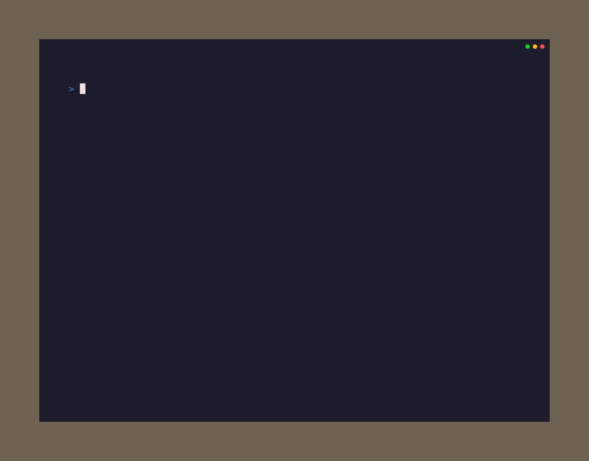

# Ripple Effect

Place digits into irregular cages so each cage contains `1..n` exactly once, and matching digits stay outside each other’s ripple distance.



## How to Play

Each outlined cage must contain the digits `1..n` exactly once, where `n` is
that cage's size. Matching digits also create a "ripple" that blocks the next
`n-1` cells in the same row and column from containing the same value.

Given cells are fixed. The puzzle is solved when every cell is filled and both
the cage and ripple rules are satisfied.

## Controls

| Key | Action |
|-----|--------|
| Arrow keys / WASD / hjkl | Move cursor |
| `1`-`9` | Place number |
| `Backspace` / `Delete` | Clear cell |
| `Ctrl+R` | Reset puzzle |
| `Ctrl+H` | Toggle full help |
| `Escape` | Return to main menu |

## Modes

| Mode | Size | Notes |
|------|------|-------|
| Mini 5x5 | 5x5 | Compact cages with extra anchors |
| Easy 6x6 | 6x6 | Steady clues and approachable spacing |
| Medium 7x7 | 7x7 | Mixed cage shapes and balanced clue spread |
| Hard 8x8 | 8x8 | Longer cages with lighter anchoring |
| Expert 9x9 | 9x9 | Winding large cages and sparse anchors |

## Quick Start

```bash
puzzletea new ripple-effect
puzzletea new ripple "Medium 7x7"
puzzletea new ripple-effect "Hard 8x8" --with-seed sample-seed
```
