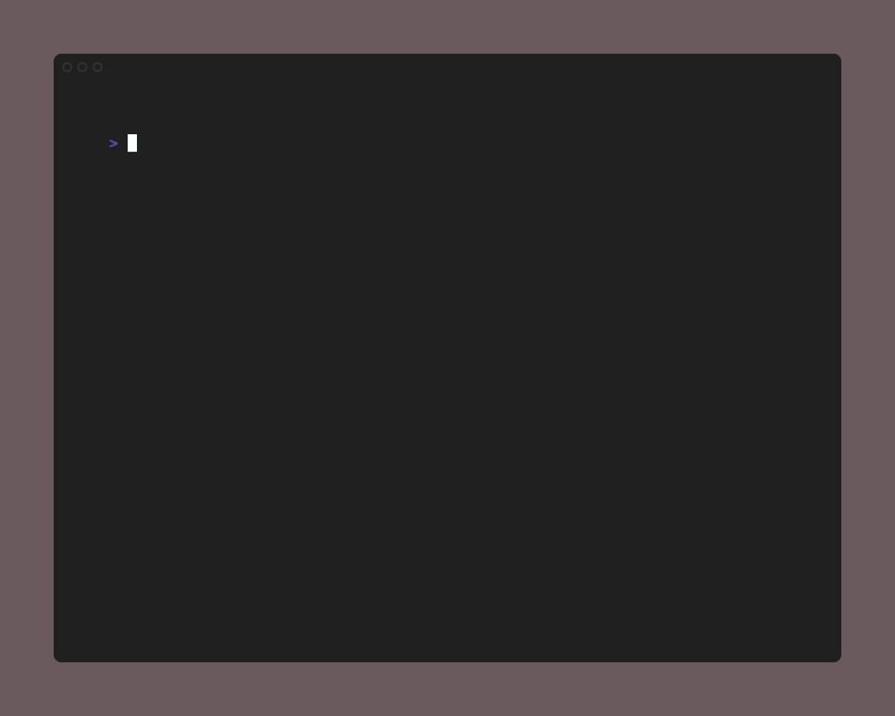

# Sudoku

Classic 9x9 number placement puzzle.



## How to Play

Fill every empty cell with a digit from 1 to 9 so that each row, each
column, and each 3x3 box contains every digit exactly once. Pre-filled
cells (shown in bold) cannot be changed. Conflicting cells are highlighted
in red.

## Controls

| Key | Action |
|-----|--------|
| Arrow keys / WASD / hjkl | Move cursor |
| `1`-`9` | Fill cell with digit |
| `Backspace` | Clear cell |
| `Ctrl+R` | Reset puzzle |
| `Ctrl+H` | Toggle full help |
| `Ctrl+E` | Toggle debug overlay |
| `Ctrl+N` | Return to main menu |

## Modes

| Mode | Clues | Description |
|------|-------|-------------|
| Beginner | 45 | Single Candidate / Scanning |
| Easy | 38 | Naked Singles |
| Medium | 32 | Hidden Pairs / Pointing |
| Hard | 27 | Box-Line Reduction / Triples |
| Expert | 22 | X-Wing / Y-Wing |
| Diabolical | 17 | Swordfish / XY-Chains |

## Quick Start

```bash
puzzletea new sudoku beginner
puzzletea new sudoku medium
puzzletea new sudoku diabolical
```
